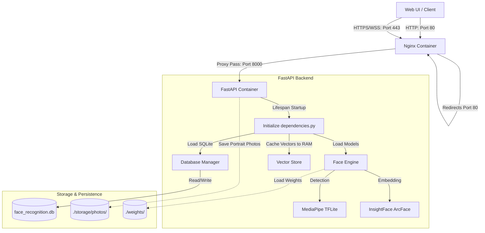

# Sơ đồ và Luồng chạy của Hệ thống trên Server

Hệ thống được đóng gói bằng **Docker Compose**, bao gồm 2 container dịch vụ chạy song song:
1. **`face_recognition_nginx`**: Nginx đóng vai trò Reverse Proxy, hỗ trợ HTTPS và định tuyến traffic (REST & WebSocket).
2. **`face_recognition_api`**: Backend FastAPI chịu trách nhiệm xử lý logic nghiệp vụ và chạy các mô hình AI (MediaPipe + InsightFace).

---

## 1. Sơ đồ Kiến trúc & Luồng Dữ liệu



---

## 2. Các Luồng Hoạt động Chi tiết

### 2.1. Luồng Khởi động Hệ thống (Startup Flow)

Khi chạy lệnh `docker compose up -d`, quy trình khởi động diễn ra như sau:

1. **Khởi động Nginx**:
   - Nginx mount file cấu hình `nginx.conf` và thư mục chứng chỉ SSL `nginx/certs`.
   - Nginx lắng nghe cổng `80` (HTTP) và `443` (HTTPS). Mọi request HTTP thông thường đến cổng 80 sẽ tự động được redirect (301) sang cổng 443 để bảo mật camera stream.

2. **Khởi động FastAPI (Uvicorn)**:
   - Container `face_recognition_api` chạy ứng dụng FastAPI.
   - Trực tiếp chạy hàm **`lifespan`** (Startup Hook) trong `main.py` để khởi tạo các **Singleton Dependency** trong `api/dependencies.py`:
     - **DatabaseManager**: Kết nối cơ sở dữ liệu SQLite tại `./database/face_recognition.db` và khởi tạo schema nếu chưa có.
     - **FaceEngine**: Tải các mô hình học máy vào bộ nhớ:
       - Mô hình face detection: MediaPipe (`blaze_face_short_range.tflite`).
       - Mô hình face embedding: InsightFace (`buffalo_sc`).
     - **VectorStore**: Đọc toàn bộ nhân sự đã đăng ký cùng vector embedding (512 chiều) từ database SQLite và nạp vào bộ nhớ RAM dưới dạng cache để tìm kiếm cosine similarity siêu tốc.

---

### 2.2. Luồng Đăng ký Nhân sự (Register/CRUD Flow)

Khi người dùng thực hiện đăng ký nhân sự mới từ Web UI thông qua endpoint `POST /api/persons/`:

```
[Client] ──(FormData: Info + Photo)──> [Nginx (443)] ──> [FastAPI (8000)]
                                                            │
  ┌─────────────────────────────────────────────────────────┘
  ▼
[FastAPI]
  1. Giải mã file ảnh (OpenCV BGR).
  2. Dùng MediaPipe kiểm tra số lượng khuôn mặt:
     - Không có mặt hoặc nhiều hơn 1 mặt -> Báo lỗi (422).
  3. Trích xuất vector embedding (512-d) từ khuôn mặt thông qua InsightFace.
  4. Lưu file ảnh chân dung gốc vào thư mục `./storage/photos/{cccd}.jpg` (được mount volume).
  5. SQLite lưu thông tin chi tiết và lưu mảng vector embedding dưới dạng BLOB.
  6. Thêm ID nhân sự, tên và vector embedding mới vào bộ nhớ RAM của VectorStore.
  7. Trả về kết quả đăng ký thành công cho Client.
```

---

### 2.3. Luồng Nhận diện Realtime qua WebSocket (WebSocket Realtime Stream Flow)

Đây là luồng quan trọng nhất để xử lý mượt mà và tối ưu hóa tài nguyên server (đặc biệt khi chạy trên CPU):

```
[Web UI] ──(Thiết lập kết nối)──> [WSS /api/recognize/stream] ──> [FastAPI Server]
   │                                                                     │
   │  ┌──────────────────────────────────────────────────────────────────┘
   ▼  ▼
[Vòng lặp Stream]:
   1. Client gửi JSON chứa frame hình ảnh (Base64 JPEG) và ngưỡng nhận diện (threshold).
   2. Server nhận tin nhắn, decode Base64 sang OpenCV BGR numpy array.
   3. Chạy MediaPipe Detection để tìm bounding box (bbox) của các khuôn mặt kèm bộ lọc chất lượng (độ mờ blur, góc quay yaw/pitch/roll).
   4. Bỏ qua các khuôn mặt có diện tích nhỏ hơn `MIN_FACE_AREA` (mặc định 60x60px) để hạn chế nhiễu ở hậu cảnh.
   5. Cập nhật dữ liệu vào tracker (`SimpleTracker`) dựa trên thuật toán IoU (Intersection over Union):
      - Nhận diện các bbox trùng khớp và gán cố định `track_id`.
   6. Với mỗi Track hoạt động:
      - Nếu là Track mới xuất hiện (chưa có embedding cache) HOẶC thời gian cooldown đã hết (`TRACK_COOLDOWN` = 1 giây):
        -> Gọi InsightFace trích xuất vector embedding của khuôn mặt đó.
        -> Tìm kiếm trong VectorStore (so sánh Cosine Similarity trên RAM).
        -> Cập nhật ID, tên nhân sự và trạng thái nhận diện vào Track đó.
      - Nếu Track cũ và chưa hết cooldown:
        -> SỬ DỤNG LẠI kết quả đã lưu trong cache của Track (không cần chạy mô hình InsightFace).
   7. Vẽ bounding box và hiển thị nhãn (Tên nhân sự + Cosine similarity hoặc "Unknown") lên frame gốc.
   8. Encode frame đã vẽ sang JPEG chất lượng 75%, chuyển sang Base64.
   9. Gửi JSON phản hồi về Client gồm: ảnh Base64 mới, danh sách tọa độ/tên nhận diện, và FPS hiện tại của server.
```

---

### 2.4. Luồng Nhận diện Ảnh tĩnh (Static Image Recognition Flow)

Dành cho tính năng tải ảnh tĩnh lên qua endpoint `POST /api/recognize/image`:

1. **Client** gửi file ảnh qua HTTP POST Multipart.
2. **FastAPI** decode ảnh và gọi `FaceEngine.detect` (không sử dụng tracker).
3. Với mỗi khuôn mặt phát hiện được, trích xuất embedding và thực hiện so khớp cosine similarity trên bộ nhớ `VectorStore`.
4. Vẽ bounding box của tất cả khuôn mặt kèm nhãn thông tin tương ứng.
5. Encode ảnh kết quả sang Base64 và gửi trả về kèm danh sách metadata chi tiết cho Client.

---

## 3. Các cơ chế Tối ưu hóa Hiệu năng trên Server

- **RAM Vector Store**: Việc so sánh vector khuôn mặt được thực hiện hoàn toàn trên RAM (numpy dot-product) thay vì truy vấn SQLite mỗi frame, giúp tốc độ tìm kiếm đạt dưới 1 miligiây ngay cả với hàng ngàn nhân sự.
- **Conditional Inference (Tracking Cooldown)**: Thay vì chạy mô hình ArcFace (nặng nhất) cho 30 frames mỗi giây trên mỗi khuôn mặt, hệ thống chỉ chạy ArcFace **1 lần mỗi giây** cho mỗi khuôn mặt nhờ vào cơ chế tracking và caching. Việc này giúp giảm tải CPU/GPU lên tới **90%**.
- **Volume Mounting**: Toàn bộ database SQLite, ảnh gốc nhân viên và trọng số mô hình được lưu trữ ở ổ đĩa máy chủ (host), giúp dữ liệu không bị mất khi container Docker restart hoặc build lại.
- **Nginx HTTPS**: Bắt buộc phải có HTTPS hoặc chạy trên `localhost` thì trình duyệt trên client mới cho phép truy cập luồng webcam của người dùng vì lý do bảo mật bảo vệ quyền hiện tư.
