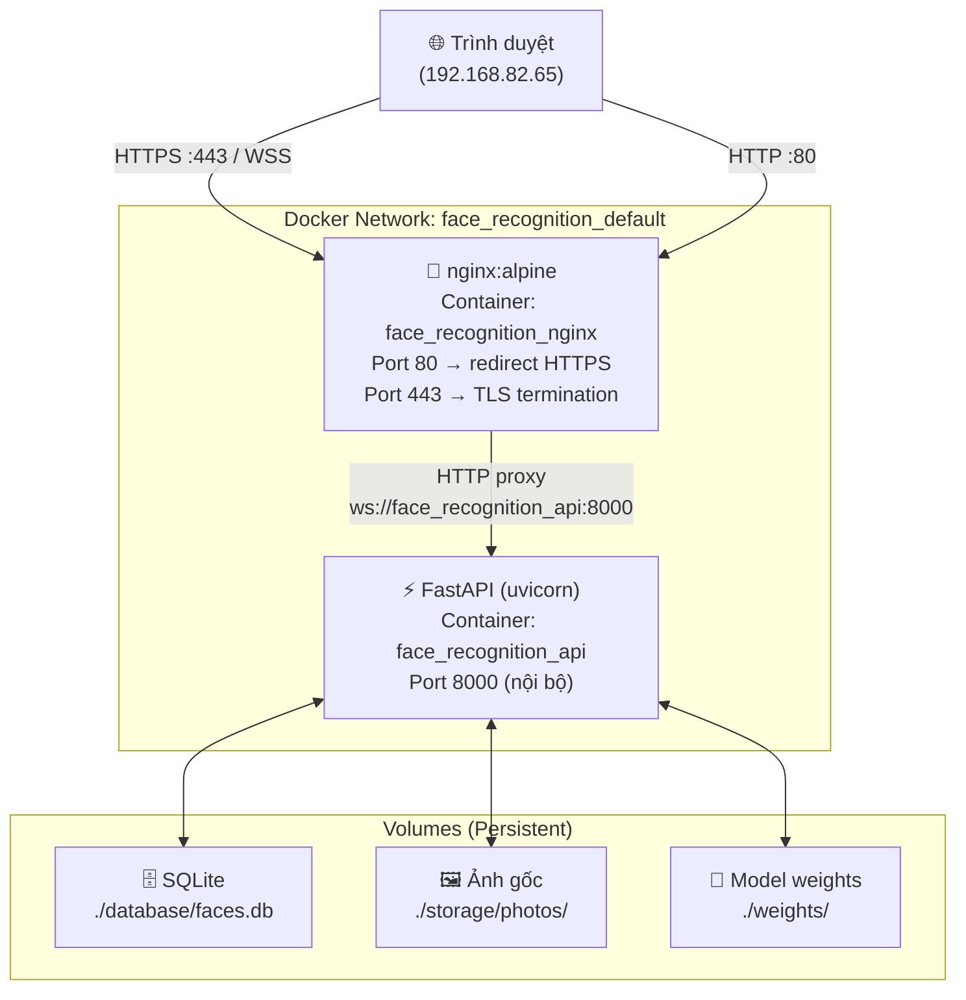
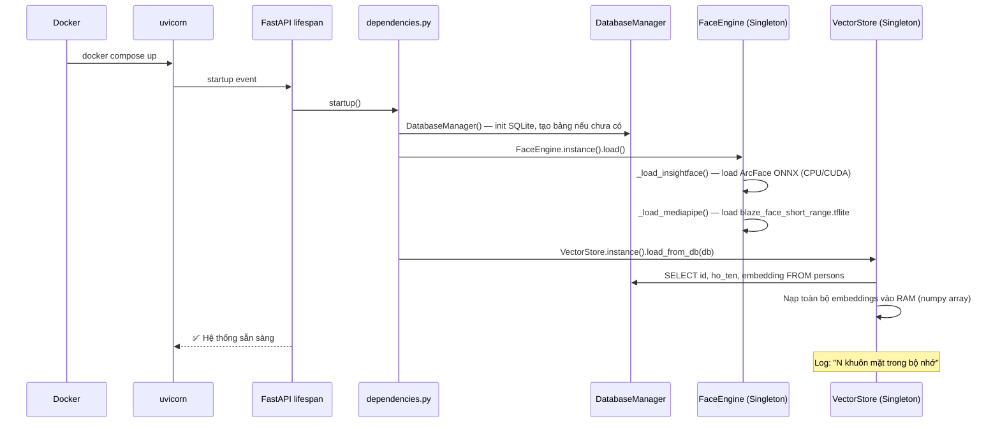
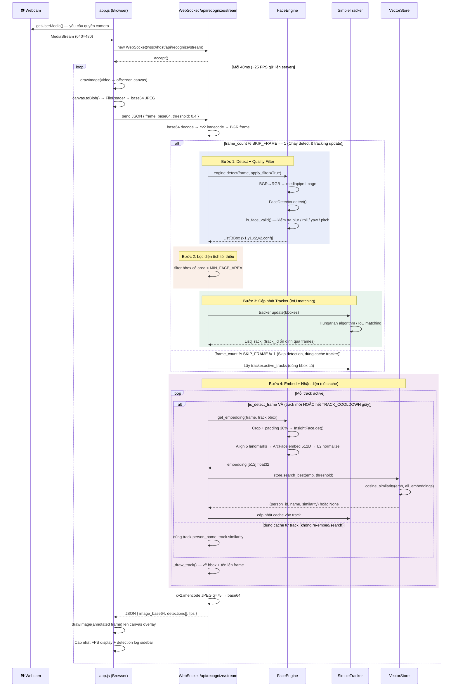
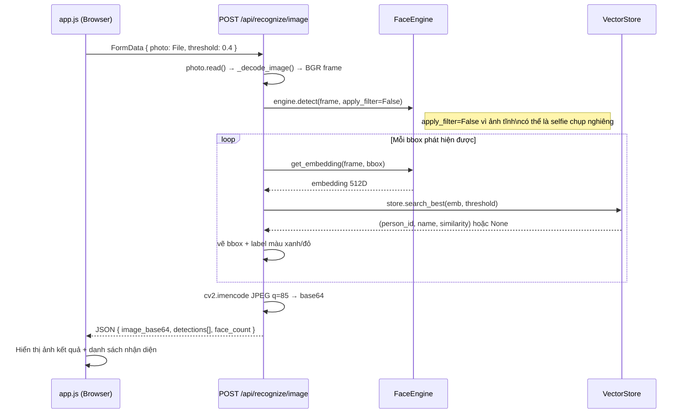
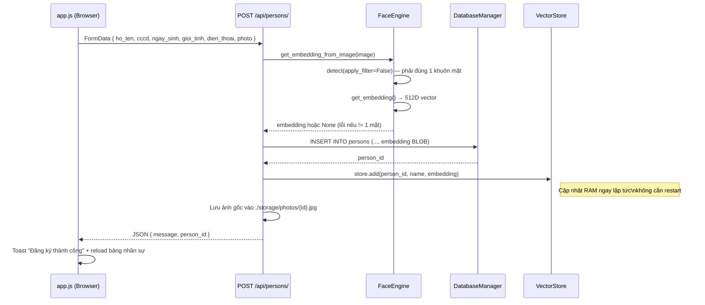

# Luồng Chi Tiết Hệ Thống — Face Recognition

## 1. Kiến trúc tổng quan



---

## 2. Khởi động hệ thống (Startup)



---

## 3. Luồng Webcam Realtime (WebSocket)



---

## 4. Luồng Nhận diện từ Ảnh tĩnh (REST)



---

## 5. Luồng Đăng ký Nhân sự (CRUD)



---

## 6. Cấu trúc dữ liệu quan trọng

### VectorStore (in-memory)
```
RAM:
  embeddings: np.ndarray  shape=(N, 512)  float32
  ids:        List[int]   — person_id tương ứng
  names:      List[str]   — tên tương ứng

search_best(query_emb, threshold):
  scores = embeddings @ query_emb  (cosine similarity, đã L2-normalize)
  best_idx = argmax(scores)
  if scores[best_idx] >= threshold → trả về (ids[best_idx], names[best_idx], scores[best_idx])
  else → None
```

### Track (Tracker)
```python
Track:
  track_id:        int       # ID ổn định qua frames
  bbox:            BBox      # vị trí hiện tại
  embedding:       ndarray?  # cache embedding 512D
  last_embed_time: float     # timestamp lần embed gần nhất
  person_id:       int?      # kết quả nhận diện cache
  person_name:     str?
  similarity:      float
  recognized:      bool
  lost:            int       # số frame liên tiếp không thấy
```

---

## 7. Tóm tắt các endpoint

| Method | URL | Mô tả |
|--------|-----|--------|
| `GET` | `/health` | Health check, trả về số người trong RAM |
| `GET` | `/` | Serve `static/index.html` |
| `POST` | `/api/recognize/image` | Nhận diện ảnh tĩnh |
| `WS` | `/api/recognize/stream` | Webcam realtime qua WebSocket |
| `POST` | `/api/persons/` | Đăng ký nhân sự mới |
| `GET` | `/api/persons/` | Danh sách tất cả nhân sự |
| `GET` | `/api/persons/search?q=` | Tìm kiếm nhân sự |
| `DELETE` | `/api/persons/{id}` | Xóa nhân sự |
